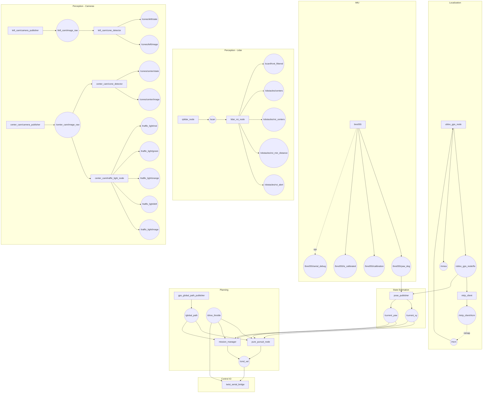

# HAMHAM

## 구조도

```mermaid
graph TD

%% ========== Localization (GPS + NTRIP) ==========
subgraph Localization
  U[ublox_gps_node]
  N[ntrip_client]

  Fix((/ublox_gps_node/fix))
  NMEA((/nmea))
  Nrtcm((/ntrip_client/rtcm))
  RTCM((/rtcm))

  U --> Fix
  U --> NMEA
  Fix --> N
  N --> Nrtcm
  Nrtcm -. remap .-> RTCM
  RTCM --> U
end

%% ========== IMU (BNO055) ==========
subgraph IMU
  B[bno055]
  Yaw((/bno055/yaw_deg))
  Cal((/bno055/calibration))
  Ready((/bno055/is_calibrated))
  Debug((/bno055/serial_debug))
  B --> Yaw
  B --> Cal
  B --> Ready
  B -. opt .-> Debug
end

%% ========== State Estimation ==========
subgraph State Estimation
  P[pose_publisher]
  XY((/current_xy))
  Y((/current_yaw))
  Fix --> P
  Yaw --> P
  P --> XY
  P --> Y
end

%% ========== Planner / Control ==========
subgraph Planning
  G[gps_global_path_publisher]
  PATH((/global_path))
  G --> PATH

  PP[pure_pursuit_node]
  PATH --> PP
  XY --> PP
  Y --> PP
  Throttle((/drive_throttle)) --> PP
  CMD((/cmd_vel))
  PP --> CMD

  MM[mission_manager]
  PATH --> MM
  XY --> MM
  Y --> MM
  Throttle --> MM
  MM --> CMD
end

subgraph Control IO
  TSB[twist_serial_bridge]
  CMD --> TSB
  Throttle --> TSB
end

%% ========== Perception (Lidar / Camera) ==========
subgraph Perception - Lidar
  LIDAR[rplidar_node]
  SCAN((/scan))
  LIDAR --> SCAN
  LidarROI[lidar_roi_node]
  SCAN --> LidarROI
  FRONT((/scan/front_filtered))
  OBST((/obstacles/centers))
  ROI((/obstacles/roi_centers))
  MIND((/obstacles/roi_min_distance))
  ALERT((/obstacles/roi_alert))
  LidarROI --> FRONT
  LidarROI --> OBST
  LidarROI --> ROI
  LidarROI --> MIND
  LidarROI --> ALERT
end

subgraph Perception - Cameras
  LC[left_cam/camera_publisher] --> LeftImg((/left_cam/image_raw))
  CC[center_cam/camera_publisher] --> CenterImg((/center_cam/image_raw))

  ConeL[left_cam/cone_detector]
  LeftImg --> ConeL
  ConeL --> CLSL((/cones/left/state))
  ConeL --> IML((/cones/left/image))

  ConeC[center_cam/cone_detector]
  CenterImg --> ConeC
  ConeC --> CLSC((/cones/center/state))
  ConeC --> IMC((/cones/center/image))

  TL[center_cam/traffic_light_node]
  CenterImg --> TL
  TL --> TLR((/traffic_light/red))
  TL --> TLG((/traffic_light/green))
  TL --> TLO((/traffic_light/orange))
  TL --> TLL((/traffic_light/left))
  TL --> TLIMG((/traffic_light/image))
end

```