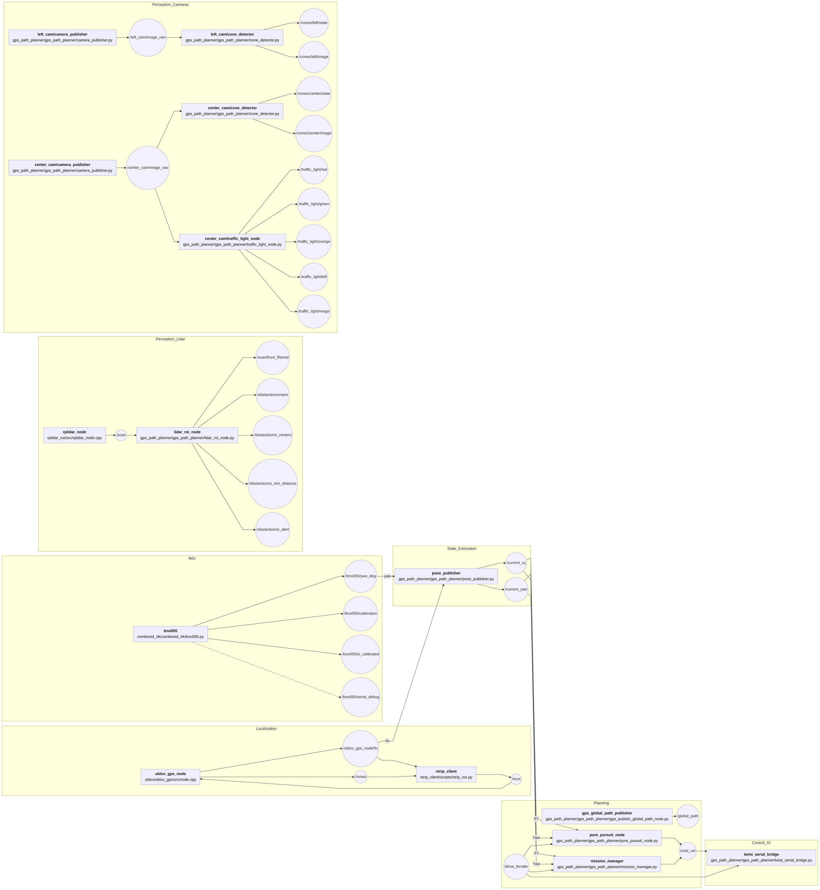

# HAMHAM

## 차량모습

## 사용센서
### GPS
- AS-STARTKIT-BASIC-L1L2-NH-02(u-blox ZED-F9P)
### IMU
-  Adafruits BNO055
### 카메라
- 로지텍 C920 웹캠 (2개)
### 라이다 
- SLAMTEC RPLIDAR : A2M12

## 예선 주행 동영상
### 예선 1차 주행
https://github.com/user-attachments/assets/9c30865d-1c16-4d77-8ea1-ea078ad7916f

### 예선 2차 주행
https://github.com/user-attachments/assets/5583dcc6-c27f-4663-b9b7-700495dcbb3e

## ROS2 TOPIC, 폴더 및 파일 구조도

