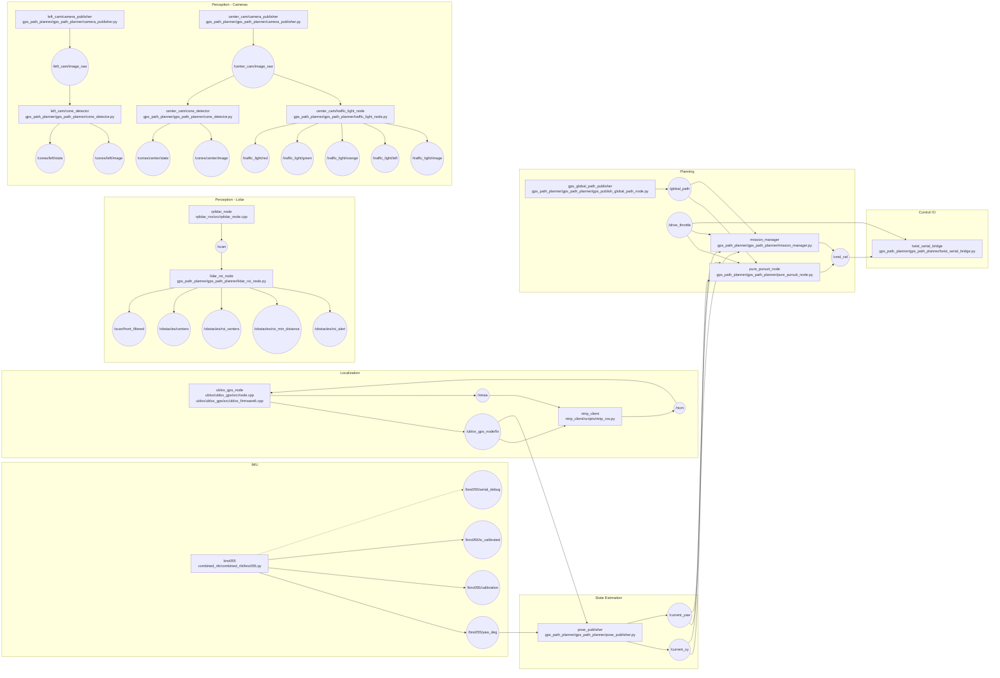

# HAMHAM

## 폴더 및 파일 구조도

```mermaid
graph LR

%% ========== Localization (GPS + NTRIP) ==========
subgraph Localization
  U[ublox_gps_node<br/>ublox/ublox_gps/src/node.cpp<br/>ublox/ublox_gps/src/ublox_firmware6.cpp]
  N[ntrip_client<br/>ntrip_client/scripts/ntrip_ros.py]

  Fix((/ublox_gps_node/fix))
  NMEA((/nmea))
  RTCM((/rtcm))

  U --> Fix
  U --> NMEA
  Fix --> N
  NMEA --> N
  N --> RTCM
  RTCM --> U
end

%% ========== IMU (BNO055) ==========
subgraph IMU
  B[bno055<br/>combined_rtk/combined_rtk/bno055.py]
  Yaw((/bno055/yaw_deg))
  Cal((/bno055/calibration))
  Ready((/bno055/is_calibrated))
  Debug((/bno055/serial_debug))
  B --> Yaw
  B --> Cal
  B --> Ready
  B -.-> Debug
end

%% ========== State Estimation ==========
subgraph State Estimation
  P[pose_publisher<br/>gps_path_planner/gps_path_planner/pose_publisher.py]
  XY((/current_xy))
  Y((/current_yaw))
  Fix --> P
  Yaw --> P
  P --> XY
  P --> Y
end

%% ========== Planner / Control ==========
subgraph Planning
  G[gps_global_path_publisher<br/>gps_path_planner/gps_path_planner/gps_publish_global_path_node.py]
  PATH((/global_path))
  G --> PATH

  PP[pure_pursuit_node<br/>gps_path_planner/gps_path_planner/pure_pursuit_node.py]
  PATH --> PP
  XY --> PP
  Y --> PP
  Throttle((/drive_throttle)) --> PP
  CMD((/cmd_vel))
  PP --> CMD

  MM[mission_manager<br/>gps_path_planner/gps_path_planner/mission_manager.py]
  PATH --> MM
  XY --> MM
  Y --> MM
  Throttle --> MM
  MM --> CMD
end

subgraph Control IO
  TSB[twist_serial_bridge<br/>gps_path_planner/gps_path_planner/twist_serial_bridge.py]
  CMD --> TSB
  Throttle --> TSB
end

%% ========== Perception - Lidar ==========
subgraph Perception - Lidar
  LIDAR[rplidar_node<br/>rplidar_ros/src/rplidar_node.cpp]
  SCAN((/scan))
  LIDAR --> SCAN
  LidarROI[lidar_roi_node<br/>gps_path_planner/gps_path_planner/lidar_roi_node.py]
  SCAN --> LidarROI
  FRONT((/scan/front_filtered))
  OBST((/obstacles/centers))
  ROI((/obstacles/roi_centers))
  MIND((/obstacles/roi_min_distance))
  ALERT((/obstacles/roi_alert))
  LidarROI --> FRONT
  LidarROI --> OBST
  LidarROI --> ROI
  LidarROI --> MIND
  LidarROI --> ALERT
end

%% ========== Perception - Cameras ==========
subgraph Perception - Cameras
  LC[left_cam/camera_publisher<br/>gps_path_planner/gps_path_planner/camera_publisher.py] --> LeftImg((/left_cam/image_raw))
  CC[center_cam/camera_publisher<br/>gps_path_planner/gps_path_planner/camera_publisher.py] --> CenterImg((/center_cam/image_raw))

  ConeL[left_cam/cone_detector<br/>gps_path_planner/gps_path_planner/cone_detector.py]
  LeftImg --> ConeL
  CLSL((/cones/left/state))
  IML((/cones/left/image))
  ConeL --> CLSL
  ConeL --> IML

  ConeC[center_cam/cone_detector<br/>gps_path_planner/gps_path_planner/cone_detector.py]
  CenterImg --> ConeC
  CLSC((/cones/center/state))
  IMC((/cones/center/image))
  ConeC --> CLSC
  ConeC --> IMC

  TL[center_cam/traffic_light_node<br/>gps_path_planner/gps_path_planner/traffic_light_node.py]
  CenterImg --> TL
  TLR((/traffic_light/red))
  TLG((/traffic_light/green))
  TLO((/traffic_light/orange))
  TLL((/traffic_light/left))
  TLIMG((/traffic_light/image))
  TL --> TLR
  TL --> TLG
  TL --> TLO
  TL --> TLL
  TL --> TLIMG
end

```
